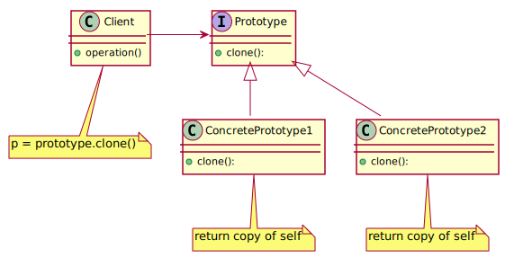

# Prototype

The Prototype design pattern is a creational design pattern that allows an object to create customized objects without knowing their class or any details of how to create them.

## Intent

The intent of the Prototype design pattern is to allow an object to create customized objects without knowing their class or any details of how to create them. This allows for greater flexibility and reuse of object creation code.

## Problem

There are situations where creating a new object from scratch is inefficient or infeasible. For example, creating an object might require expensive resources, or the object's class might not have an accessible public constructor. The Prototype design pattern allows you to create new objects by copying existing objects, which can be more efficient and flexible than creating objects from scratch.

## Solution

The Prototype design pattern solves this problem by separating the construction of the object from its representation. It does this by defining an interface (or abstract class) that declares a clone method, and concrete implementations of this method in concrete prototypes. To create a new object, the client calls the clone method on an existing prototype object.

This allows the same object creation code to be used to create different representations of the object. The concrete prototypes keep track of the representation they are creating, and the product class represents the complex object being built.

By using the Prototype design pattern, you can create complex objects in a flexible and reusable way, without the need to specify all of the details of the object's representation in a single constructor.

## Structure

## Participants

- **Prototype**: Declares an interface for cloning itself.
- **ConcretePrototype**: Implements the cloning operation.
  
## Related Design Patterns

The Prototype design pattern is often used in conjunction with the ***Abstract Factory*** pattern, which provides an interface for creating families of related or dependent objects without specifying their concrete classes. The Prototype pattern allows concrete prototypes to be created by the Abstract Factory, and then customized by adding or modifying their properties.