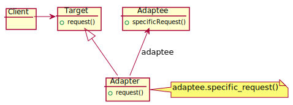

# Adapter Design Pattern
The Adapter design pattern is a structural pattern that allows objects with incompatible interfaces to collaborate. It translates the calls to the interface required by a client into calls to the objects that the client expects.

## Intent
- Convert the interface of a class into another interface clients expect.
- Adapter lets classes work together that couldn't otherwise because of incompatible interfaces.
- The pattern is used when existing classes have the functionality required by a new system but their interfaces don't match the interfaces required by the new system.
  
## Problem
- You want to reuse existing classes that don't have the required interface.
- You want to create a reusable class that cooperates with unrelated or unforeseen classes.
- A class has some abilities that another class requires, but the two classes have incompatible interfaces.
  
## Solution
Create a wrapper class that can be used by the client class as if it were the original class. The adapter class implements the required interface and translates calls from the client to the original class.

## Structure

## Participants
- **Target**: defines the domain-specific interface that Client uses.
- **Client**: collaborates with objects conforming to the Target interface.
- **Adaptee**: defines an existing interface that needs adapting.
- **Adapter**: adapts the interface of Adaptee to the Target interface.
  
## Related Design Patterns
- ***Bridge*** has a structure similar to an object adapter, but Bridge has a different
intent: It is meant to separate an interface from its implementation so that they can
be varied easily and independently. An adapter is meant to change the interface
of an existing object.
- ***Decorator*** enhances another object without changing its interface. A decorator is thus more transparent to the application than an adapter is. As a consequence, Decorator supports recursive composition, which isn't possible with pureadapters.
- ***Proxy*** defines a representative or surrogate for another object and does not
change its interface.