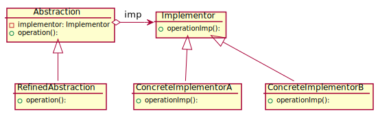

# Bridge Design Pattern
The Bridge Design Pattern is a structural design pattern that separates the abstraction from its implementation so that the two can vary independently. This pattern is used to decouple the abstraction from its implementation so that the two can be modified independently.

## Intent
- Decouple an abstraction from its implementation so that the two can vary independently.
- Publish interface in an inheritance hierarchy, and bury implementation in its own inheritance hierarchy.

## Problem
- An abstraction and its implementation should be defined and extended independently from each other.
- A set of implementations should be interchangeable with their client code.

## Solution
The Bridge pattern involves an interface hierarchy and a class hierarchy. The interface hierarchy defines the abstractions, while the class hierarchy defines the implementation. The implementation can be changed without affecting the client code.

## Structure

## Participants
- **Abstraction**: defines the abstraction's interface. Maintains a reference to an object of type Implementor.
- **RefinedAbstraction**: extends the interface defined by Abstraction.
- **Implementor**: defines the interface for implementation classes. This interface doesn't have to correspond exactly to Abstraction's interface; in fact, the two interfaces can be quite different. Typically the Implementor interface provides only primitive operations, and Abstraction defines higher-level operations based on these primitives.
- **ConcreteImplementor**: implements the Implementor interface and defines its concrete implementation.

## Related Design Patterns
- An ***Abstract Factory***  can create and configure a particular Bridge.
- The ***Adapter*** pattern is geared toward making unrelated classes work together. It is usually applied to systems after they're designed. Bridge, on the other
hand, is used up-front in a design to let abstractions and implementations vary
independently.